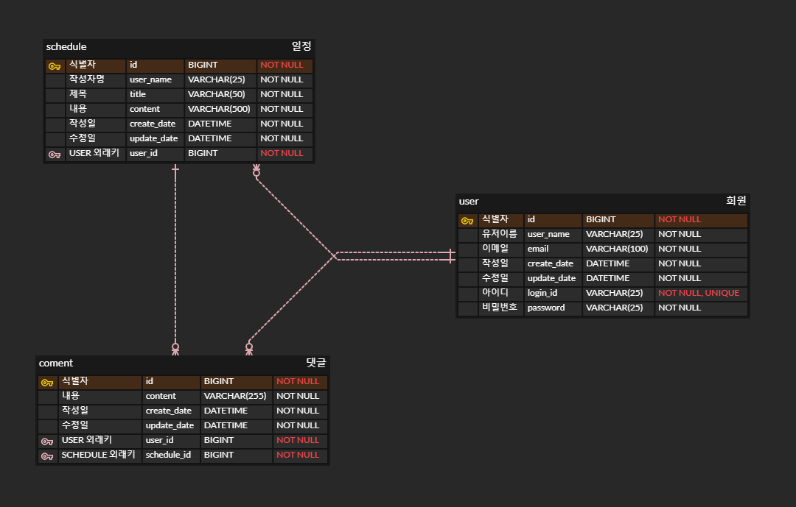

- ERD

3줄 요약

1. URL에 /cl 이 들어가 있는 녀석들은 로그인이 필요한 요청이여서 필터에 검사 url로 넣어논 녀석들 입니다. 왜 cl이냐 하시면 check login 줄인거에요 :D
2. 이번엔 에러를 최대한 구체적으로 보내기 위해 작명들도 몇개 해보았습니다..
3. Stream을 사용도 해보았고 비슷한 흐름의 코드도 있는데... 길이를 보니까 아차 싶더라구요... 너그럽게 이해해주면...>< 